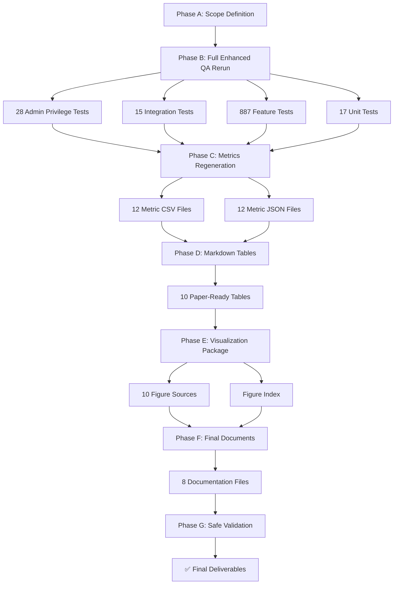

# Figure 1: QA Pipeline Diagram

## Overview

This diagram illustrates the complete QA enhancement pipeline, from scope definition through final validation.

## Source (Mermaid)

## Key Process Steps

| Phase | Description                                   | Deliverables                          |
| ----- | --------------------------------------------- | ------------------------------------- |
| A     | Establish scope, risks, and quality gates     | TRACEABILITY.md, qa-rerun-report.md   |
| B     | Execute full test suite; capture real results | 947 tests (793 pass); execution logs  |
| C     | Generate 12 metric file pairs (CSV + JSON)    | 24 metric files from real execution   |
| D     | Convert metrics to 10 markdown tables         | Paper-ready formatted tables          |
| E     | Create 10 visualization sources + figures     | Mermaid diagrams, figure-source notes |
| F     | Assemble 8 final documentation files          | README, SUMMARY, methodology docs     |
| G     | Validate all deliverables for consistency     | Cross-verification of all artifacts   |

## Conclusion

This pipeline demonstrates a systematic, evidence-based approach to QA enhancement with explicit traceability from scope definition through final validation.
