# Figure 3: Risk Heatmap

## Overview

This diagram presents the 12 identified risks plotted on a likelihood-impact matrix to visualize risk distribution and prioritization.

## Source (Mermaid)

```mermaid
graph TB
    CZ["CRITICAL ZONE"] --> R1["R-PRIV-001<br/>Unauthorized Access<br/>Coverage: 100%"]
    CZ --> R2["R-PRIV-002<br/>Privilege Escalation<br/>Coverage: 100%"]
    CZ --> R8["R-AUTH-001<br/>Unauth Access<br/>Coverage: 100%"]
    CZ --> R12["R-DB-001<br/>Schema Missing<br/>Coverage: 40%"]

    HZ["HIGH ZONE"] --> R3["R-API-001<br/>Integration Mutation<br/>Coverage: 100%"]
    HZ --> R5["R-API-003<br/>Idempotency Fail<br/>Coverage: 100%"]
    HZ --> R9["R-DATA-001<br/>Validation Bypass<br/>Coverage: 50%"]

    MZ["MEDIUM ZONE"] --> R4["R-API-002<br/>Context Loss<br/>Coverage: 100%"]
    MZ --> R6["R-RESV-001<br/>API Mismatch<br/>Coverage: 30%"]
    MZ --> R7["R-RESV-002<br/>Filter Error<br/>Coverage: 33%"]
    MZ --> R10["R-DATA-002<br/>Response Contract<br/>Coverage: 100%"]
    MZ --> R11["R-PERF-001<br/>Perf Regression<br/>Coverage: 100%"]

    classDef critical fill:#d32f2f,color:#ffffff,stroke:#b71c1c;
    classDef high fill:#f57c00,color:#ffffff,stroke:#e65100;
    classDef medium fill:#fbc02d,color:#000000,stroke:#f57f17;
    classDef zone fill:#eceff1,color:#263238,stroke:#90a4ae;

    class R1,R2,R8,R12 critical;
    class R3,R5,R9 high;
    class R4,R6,R7,R10,R11 medium;
    class CZ,HZ,MZ zone;
```

## Heatmap Data

| Priority | Count | Risks                                                     | Avg Coverage |
| -------- | ----- | --------------------------------------------------------- | ------------ |
| CRITICAL | 4     | R-PRIV-001, R-PRIV-002, R-AUTH-001, R-DB-001              | 82.5%        |
| HIGH     | 3     | R-API-001, R-API-003, R-DATA-001                          | 100%         |
| MEDIUM   | 5     | R-API-002, R-RESV-001, R-RESV-002, R-DATA-002, R-PERF-001 | 92.6%        |

## Key Observations

1. **Critical Risks:** 4 identified; 3/4 have full test coverage; 1 has documented environment blocker
2. **High Risks:** 3 identified; all have 100% test coverage
3. **Medium Risks:** 5 identified; 3/5 have full coverage; 2/5 blocked by schema
4. **Coverage Gap:** PostgreSQL schema incompleteness affects 2 critical risks (R-DB-001, partially R-RESV-001, R-RESV-002)

## Conclusion

Overall risk posture is strong with 8/12 risks fully covered. Environment blocker (PostgreSQL schema) is documented and acknowledged.
