# Figure 6: Risk Distribution Chart

## Overview

This diagram presents the distribution of 12 identified risks across severity levels and component areas.

## Source (Mermaid)

```mermaid
graph TB
    RDS["Risk Distribution by Severity"] --> CRIT["CRITICAL<br/>4 Risks<br/>33%"]
    RDS --> HIGH["HIGH<br/>3 Risks<br/>25%"]
    RDS --> MED["MEDIUM<br/>5 Risks<br/>42%"]

    RBC["Risks by Component"] --> PRIV["Admin Privilege<br/>R-PRIV-001<br/>R-PRIV-002"]
    RBC --> AUTH["Authentication<br/>R-AUTH-001"]
    RBC --> API["API Integration<br/>R-API-001<br/>R-API-002<br/>R-API-003"]
    RBC --> DATA["Data Layer<br/>R-DATA-001<br/>R-DATA-002"]
    RBC --> RESV["Reservations<br/>R-RESV-001<br/>R-RESV-002"]
    RBC --> PERF["Performance<br/>R-PERF-001"]
    RBC --> DB["Database<br/>R-DB-001"]

    CBS["Coverage by Severity"] --> CRIT_COV["CRITICAL: 82.5% Avg<br/>3/4 Full Coverage<br/>1/4 Schema Blocker"]
    CBS --> HIGH_COV["HIGH: 100% Coverage<br/>3/3 Fully Tested"]
    CBS --> MED_COV["MEDIUM: 92.6% Avg<br/>4/5 Full Coverage<br/>1/5 Partial"]

    classDef critical fill:#d32f2f,color:#ffffff,stroke:#b71c1c;
    classDef high fill:#f57c00,color:#ffffff,stroke:#e65100;
    classDef medium fill:#fbc02d,color:#000000,stroke:#f57f17;
    classDef strong fill:#81c784,color:#1b5e20,stroke:#2e7d32;
    classDef partial fill:#ffcc80,color:#e65100,stroke:#ef6c00;
    classDef blocked fill:#e57373,color:#ffffff,stroke:#c62828;
    classDef zone fill:#eceff1,color:#263238,stroke:#90a4ae;

    class CRIT,CRIT_COV critical;
    class HIGH,HIGH_COV high;
    class MED,MED_COV medium;
    class PRIV,AUTH,API,PERF strong;
    class DATA,RESV partial;
    class DB blocked;
    class RDS,RBC,CBS zone;
```

## Risk Count by Severity

| Severity | Count | Percentage | Key Risks                                                 |
| -------- | ----- | ---------- | --------------------------------------------------------- |
| CRITICAL | 4     | 33%        | R-PRIV-001, R-PRIV-002, R-AUTH-001, R-DB-001              |
| HIGH     | 3     | 25%        | R-API-001, R-API-003, R-DATA-001                          |
| MEDIUM   | 5     | 42%        | R-API-002, R-RESV-001, R-RESV-002, R-DATA-002, R-PERF-001 |

## Risk Count by Component

| Component       | Count  | Risks                           |
| --------------- | ------ | ------------------------------- |
| Admin Privilege | 2      | R-PRIV-001, R-PRIV-002          |
| Authentication  | 1      | R-AUTH-001                      |
| API Integration | 3      | R-API-001, R-API-002, R-API-003 |
| Data Layer      | 2      | R-DATA-001, R-DATA-002          |
| Reservations    | 2      | R-RESV-001, R-RESV-002          |
| Performance     | 1      | R-PERF-001                      |
| Database        | 1      | R-DB-001                        |
| **TOTAL**       | **12** | All identified risks            |

## Coverage Analysis

### By Severity

- **CRITICAL (82.5% avg):** Strong coverage; environment blocker for 1 risk
- **HIGH (100%):** All risks fully covered by integration and feature tests
- **MEDIUM (92.6% avg):** Strong coverage; schema blocker affects 1 risk

### By Component

- **Strongest:** Admin Privilege (100%), Authentication (100%), API Integration (100%), Performance (100%)
- **Challenged:** Reservations (30-33%), Database (40%)

## Conclusion

Risk distribution is well-balanced across severity levels. Coverage is comprehensive for high-severity and admin-critical risks. Schema blockers affect lower-priority reservation tests.
