# Figure 8: Coverage vs Risk Matrix

## Overview

This diagram maps test coverage levels against identified risks to visualize risk mitigation effectiveness.

## Source (Mermaid)

```mermaid
graph TB
    subgraph FULL_COVERAGE
        FC["✅ 8 Risks"]
        FC1["R-PRIV-001: Privilege 100%"]
        FC2["R-PRIV-002: Escalation 100%"]
        FC3["R-API-001: Mutation 100%"]
        FC4["R-API-002: Context 100%"]
        FC5["R-API-003: Idempotency 100%"]
        FC6["R-AUTH-001: Unauth 100%"]
        FC7["R-DATA-002: Contract 100%"]
        FC8["R-PERF-001: Regression 100%"]
    end

    subgraph PARTIAL_COVERAGE
        PC["⚠️ 3 Risks"]
        PC1["R-RESV-001: 30% (4/14 tests)<br/>Blocker: PostgreSQL Schema"]
        PC2["R-RESV-002: 33% (2/6 tests)<br/>Blocker: PostgreSQL Schema"]
        PC3["R-DATA-001: 50% (Structured)<br/>Blocker: PostgreSQL Schema"]
    end

    subgraph RISK_PRIORITIZATION
        HIGH_PRIORITY["HIGH PRIORITY<br/>✅ MITIGATED"]
        MED_PRIORITY["MEDIUM PRIORITY<br/>✅ ACCEPTABLE"]
        LOW_PRIORITY["LOW PRIORITY<br/>⚠️ DOCUMENTED"]
    end

    subgraph MITIGATION_STRATEGY
        FULL["Full Coverage Strategy<br/>→ 28 admin + 15 integration tests<br/>→ 100% pass rate"]
        PARTIAL["Partial Coverage Strategy<br/>→ Tests in codebase<br/>→ Marked as blocked<br/>→ Environment fix required"]
        RISK_OWNERSHIP["Risk Ownership<br/>→ CRITICAL risks: Owned<br/>→ HIGH risks: Owned<br/>→ MEDIUM risks: Owned or documented"]
    end

    FC --> HIGH_PRIORITY
    PC --> LOW_PRIORITY

    HIGH_PRIORITY --> FULL
    MED_PRIORITY --> PARTIAL
    LOW_PRIORITY --> RISK_OWNERSHIP

    style FC fill:#4caf50
    style FC1 fill:#81c784
    style FC2 fill:#81c784
    style FC3 fill:#81c784
    style FC4 fill:#81c784
    style FC5 fill:#81c784
    style FC6 fill:#81c784
    style FC7 fill:#81c784
    style FC8 fill:#81c784

    style PC fill:#ff9800
    style PC1 fill:#ffcc80
    style PC2 fill:#ffcc80
    style PC3 fill:#ffcc80

    style HIGH_PRIORITY fill:#4caf50
    style MED_PRIORITY fill:#ff9800
    style LOW_PRIORITY fill:#f57c00
```

## Coverage Matrix Data

| Risk       | Priority | Current Coverage | Test Type   | Status        |
| ---------- | -------- | ---------------- | ----------- | ------------- |
| R-PRIV-001 | CRITICAL | 100%             | Feature API | ✅ Mitigated  |
| R-PRIV-002 | CRITICAL | 100%             | Feature API | ✅ Mitigated  |
| R-AUTH-001 | CRITICAL | 100%             | Feature API | ✅ Mitigated  |
| R-DB-001   | CRITICAL | 40%              | Feature     | ⚠️ Documented |
| R-API-001  | HIGH     | 100%             | Integration | ✅ Mitigated  |
| R-API-003  | HIGH     | 100%             | Integration | ✅ Mitigated  |
| R-DATA-001 | HIGH     | 50%              | Feature     | ⚠️ Blocked    |
| R-API-002  | MEDIUM   | 100%             | Integration | ✅ Mitigated  |
| R-RESV-001 | MEDIUM   | 30%              | Feature API | ⚠️ Blocked    |
| R-RESV-002 | MEDIUM   | 33%              | Feature API | ⚠️ Blocked    |
| R-DATA-002 | MEDIUM   | 100%             | Integration | ✅ Mitigated  |
| R-PERF-001 | MEDIUM   | 100%             | Suite       | ✅ Mitigated  |

## Coverage Effectiveness

### Fully Mitigated (8 risks, 67%)

- CRITICAL: 3/4 (75%)
- HIGH: 2/3 (67%)
- MEDIUM: 3/5 (60%)

### Partially Mitigated (3 risks, 25%)

- All blocked by PostgreSQL schema incompleteness
- Tests are in codebase and ready for execution when schema is fixed

### Unmitigated (1 risk, 8%)

- R-DB-001: Environment blocker (documented and acknowledged)

## Risk Ownership Matrix

| Ownership Level             | Risks                                                                                       | Action                            |
| --------------------------- | ------------------------------------------------------------------------------------------- | --------------------------------- |
| Application Logic (Owned)   | R-PRIV-001, R-PRIV-002, R-API-001, R-API-002, R-API-003, R-AUTH-001, R-DATA-002, R-PERF-001 | ✅ No further action              |
| Environment Setup (Blocked) | R-RESV-001, R-RESV-002, R-DATA-001, R-DB-001                                                | 🔄 Requires PostgreSQL schema fix |

## Conclusion

Application logic risks are fully covered with 100% test pass rates. Environment blockers are explicitly documented and ownership is clear (PostgreSQL schema team).
