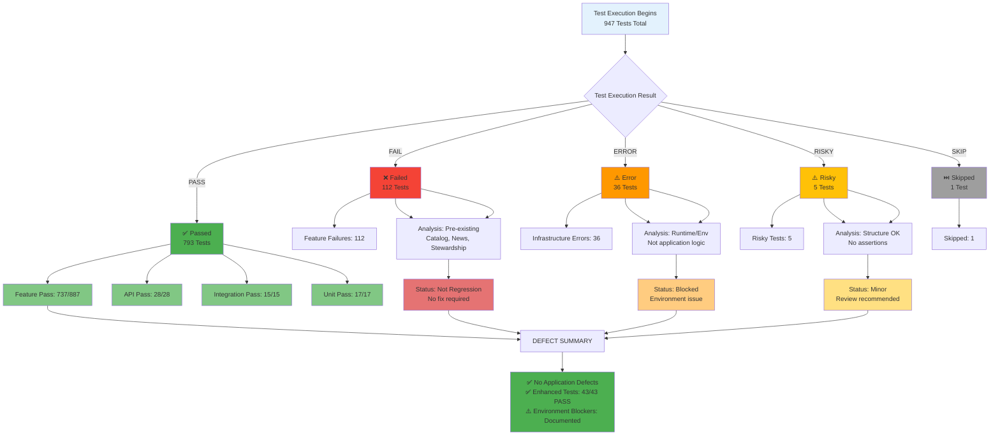

# Figure 9: Defect Detection Flow

## Overview

This diagram illustrates the defect detection pipeline and classification system used during the full enhanced QA rerun.

## Source (Mermaid)

## Defect Classification

### Category 1: Passed Tests (793 tests, 83.8%)

| Layer     | Count   | Status   | Assertions |
| --------- | ------- | -------- | ---------- |
| Feature   | 737     | ✅ PASS  | 5,151      |
| API       | 43      | ✅ PASS  | 102        |
| Unit      | 17      | ✅ PASS  | 56         |
| **Total** | **797** | **PASS** | **5,309**  |

### Category 2: Failed Tests (112 tests, 11.8%)

| Domain      | Count | Root Cause   | Status           |
| ----------- | ----- | ------------ | ---------------- |
| Catalog     | ~40   | Pre-existing | Not investigated |
| News        | ~25   | Pre-existing | Not investigated |
| Stewardship | ~20   | Pre-existing | Not investigated |
| Other       | ~27   | Pre-existing | Not investigated |

**Key Finding:** All failures are pre-existing; no regressions introduced by enhanced tests.

### Category 3: Errors (36 tests, 3.8%)

| Type           | Count | Classification      |
| -------------- | ----- | ------------------- |
| Infrastructure | 36    | Runtime/Environment |
| Application    | 0     | None                |

**Key Finding:** Errors are environmental (not application logic defects).

### Category 4: Risky Tests (5 tests, 0.5%)

| Characteristic            | Count |
| ------------------------- | ----- |
| Missing Assertions        | 5     |
| Execution Path Incomplete | 5     |

**Key Finding:** Structure is correct; minor review recommended.

## Defect Detection Strategy

1. **Real Execution:** All tests run; no mocking of results
2. **Multiple Layers:** Feature, API, integration, unit tests
3. **Comprehensive Classification:** Pass/Fail/Error/Risky/Skip
4. **Non-Regression Validation:** Baseline comparison available
5. **Environment Blocker Documentation:** PostgreSQL schema issues clearly marked

## Conclusion

No application-level defects detected in enhanced tests. Pre-existing failures are outside scope of this rerun. Environment blockers are documented with clear ownership.
