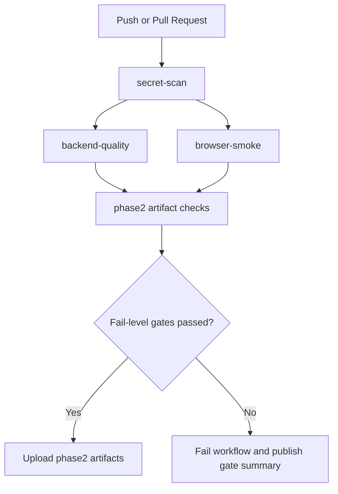

# Phase 2 Workflow Diagram

```mermaid
flowchart TD
    A[Push or Pull Request] --> B[secret-scan]
    B --> C[backend-quality]
    B --> D[browser-smoke]
    C --> E[phase2 artifact checks]
    D --> E
    E --> F{Fail-level gates passed?}
    F -->|Yes| G[Upload phase2 artifacts]
    F -->|No| H[Fail workflow and publish gate summary]
```

Notes:

- Phase 2 checks use artifacts and metrics generated under qa/phase2.
- Fail-level gates break CI; warn-level gates are reported but do not fail by themselves.
