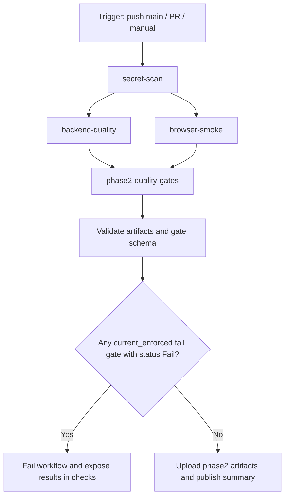

# Phase 2 Workflow Diagram

## Text Pipeline View

Trigger (push to main / pull_request to main / workflow_dispatch)
  -> secret-scan job (Gitleaks)
  -> backend-quality job (Composer QA + PHPUnit + coverage threshold + backend artifacts)
  -> browser-smoke job (frontend build + Playwright smoke + browser artifacts)
  -> phase2-quality-gates job
       -> validate required Phase 2 artifacts
       -> validate quality-gate CSV schema header
       -> evaluate current_enforced fail-level gates only
       -> upload phase2-qa-artifacts
       -> publish gate summary to GitHub Step Summary
  -> workflow result surfaced in GitHub Checks and Actions UI

## Mermaid View

Notes:
- Implemented gating currently applies only to current_enforced rows in qa/phase2/metrics/phase2-quality-gate-results.csv.
- proposed_next_stage rows are tracked for roadmap visibility and do not break CI.
- Artifact upload preserves metrics and evidence for reproducibility and auditability.
